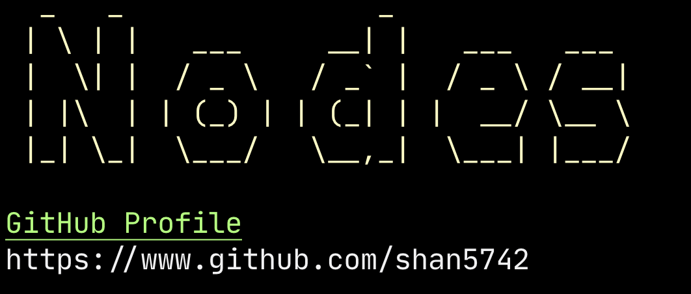
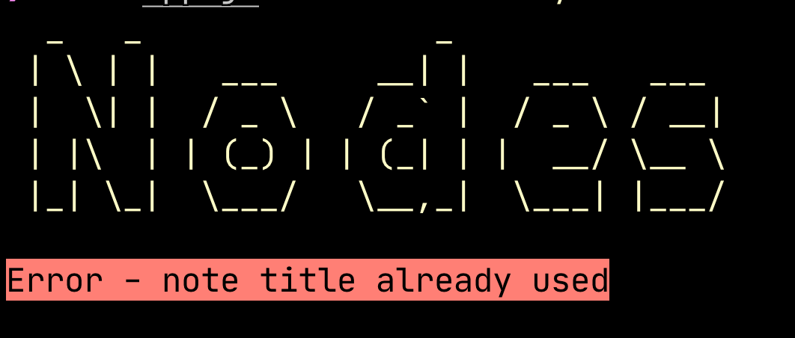

# nodes-app


Basic nodejs app for taking notes. Using **Yargs** for our command line arguments and **chalk** for displaying useful information to the user.

## Features

The app gives the ability to:

- Add a note
- Remove a note
- Read a note
- List all notes

## How to use

First clone this repo, move into the directory and run npm install:

```
git clone https://github.com/shan5742/nodes-app.git
cd nodes-app
npm i
```

### Adding a note

To add a note the program requires a keyword of **add** along with two arguments _title_ and _body_ in the form of command line arguments. First make sure you are in the corrected directory and run:

```
node app.js add --title="your note title" --body="your notes content"
```

### Removing a note

To remove a note the program requires the keyword **remove** and one argument of _title_, so if we wanted to remove the note we created above the command would be:

```
node app.js remove --title="your note title"
```

### Read a note

To read a specific note the program requires the keyword **read** and of course one argument - the _title_ of the note you are looking to read. Command:

```
node app.js read --title="your note title"
```

### List all notes

To see a list of all your notes (handy if you forgot the title of the note you want to read/delete) then you simply just need to use the keyword **list**:

```
node app.js list
```

## Still to come

In it's current for this is a very simple application. I would like to add a few things to make it more functional and a few other things to give a better user experience.

Right now all the arguments and searches are case sensitive, so you need to use the correct casing for your titles when looking to read or delete, so I will be looking in the future to make this work regardless of case.

I'd also like the program to have one command to run, for example `nodes add` and then the user will be prompted for title and body via the command line. Same goes for the other features.

## Screenshots




